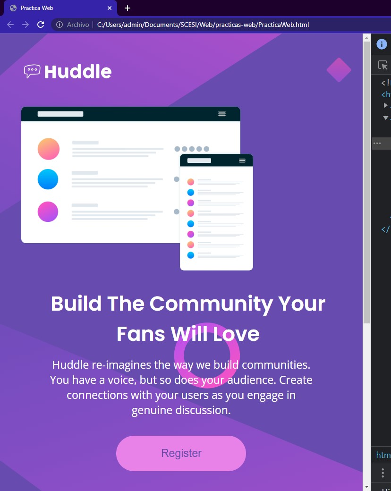
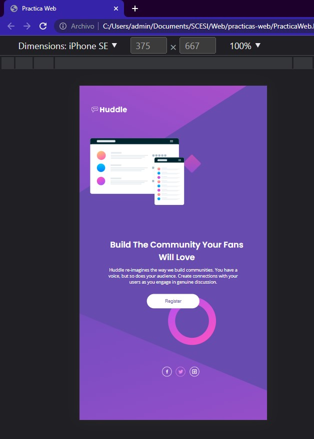

# Frontend Mentor - Huddle landing page with single introductory section solution

This is a solution to the [Huddle landing page with single introductory section challenge on Frontend Mentor](https://www.frontendmentor.io/challenges/huddle-landing-page-with-a-single-introductory-section-B_2Wvxgi0). Frontend Mentor challenges help you improve your coding skills by building realistic projects. 

  ## Tabla de contenido

- [Resumen](#resumen)
  - [El reto](#el-reto)
  - [Captura de pantalla](#captura de pantalla)
  - [Enlaces](#enlaces)
- [Mi proceso](#mi-proceso)
  - [Construido con](#construido con)
  - [Lo que aprendí](#lo-que-aprendí)
  - [Desarrollo continuo](#desarrollo-continuo)
  - [Recursos útiles](#recursos-útiles)
- [Autor](#autor)

**Nota: elimine esta nota y actualice la tabla de contenido según las secciones que conserve.**

## Descripción general

### El reto

Los usuarios deben ser capaces de:

- Ver el diseño óptimo para la página según el tamaño de pantalla de su dispositivo
- Ver estados de desplazamiento para todos los elementos interactivos en la página

### Captura de pantalla

## Mi proceso

### Construido con

- HTML
- CSS
- Cuadrícula CSS
- Tecnica Desktop first

### Que aprendí

Aprendi lo importante de la estructura html que usamos para nuestros elementos, tambien que hay varios estilos en css utiles para diversos propositos. Existen varias formas de hacer un mismo diseño, por ejemplo para hacer la pagina responsiva donde se puede usar la media query, flex, grid, segun se adapte a lo que deseas hacer. 

### Desarrollo continuo

Me parecio muy interesante las distintas formas de hacer la pagina responsiva, me gustaria seguir aprendiendo mas sobre ello ya que existen varias formas de hacerlo y esto se debe escoger y adaptar segun el diseño de nuestra pagina.

## Autor

- Sitio web - [Camila] (es un sitio local)
- Mentor de frontend - [@tunombredeusuario](https://www.frontendmentor.io/profile/tunombredeusuario)
- Twitter - [@tunombredeusuario](https://www.twitter.com/tunombredeusuario)
